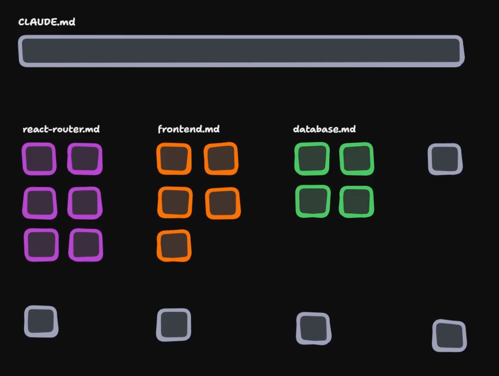
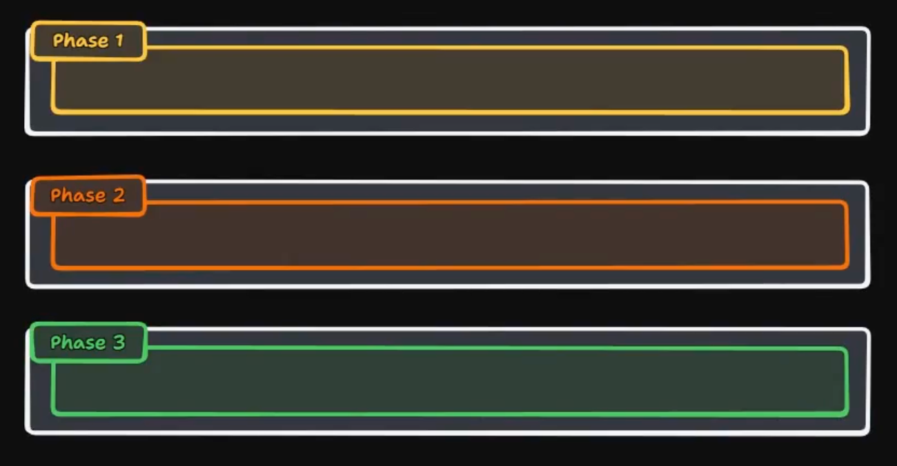
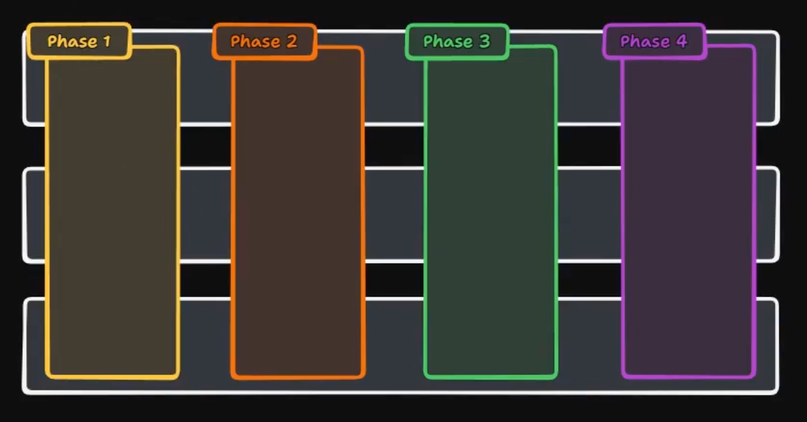

# AI for real engineers

My personal notes taken throughout the [AI Coding for Real Engineers](https://www.aihero.dev/cohorts/claude-code-for-real-engineers-2026-04) cohort. This is a 2-week course where we explore how to use Claude Code — an AI coding assistant built by Anthropic — to build and maintain a full-stack course platform.

## Day 1: Fundamentals

LLM constraints, subagents, cobebase exploration, building features.

### The constraints of LLMS

The context window, is the first and main constraint of LLMs. It represents the amount of information the model can consider at once. As the amount of information in the context window increases, the cost of using the model also increases and it starts to get dumber, which is specially noticeable when we are using more than 40% of the context window.

Additionally, LLMs are stateless, which means that they don't have memory of previous interactions. This can be a problem when we want to build complex applications that require multiple interactions with the model.

### Subagents

Subagents are specialized agents that can be called by the main agent to perform specific tasks. They can help to overcome the limitations of the main agent by providing additional capabilities or expertise. They also help to keep the main agent's context window clear by offloading specific tasks to the subagents.

### Exploring the codebase

When willing to explore the codebase in depth it's important to use the word "explore" instead of words like "understand" or "read", as it triggers the exploration subagent, which is designed to navigate and understand the codebase. It's also important to provide specific instructions on what we want to explore, such as "explore the user authentication flow" or "explore the database schema" so that the subagent can focus on the relevant parts of the codebase.

### Plan Mode

Plan mode is a feature of Claude Code that allows us to create a plan for a specific task or feature. It helps to break down complex tasks into smaller, manageable steps and provides a clear roadmap for implementation. To use plan mode, we can simply say "Let's switch to plan mode" and then provide the details of the task or feature we want to implement. The model will then generate a plan with the necessary steps to complete the task.

### Plan Execution Clear Loop

The plan execution clear loop is a technique used to ensure that the model stays focused on the task at hand and doesn't get overwhelmed by the amount of information in the context window.

It involves executing the following steps:

1. Create a plan for the task or feature we want to implement.
2. Execute the plan.
3. Check if we entered the dumb zone.
4. If we entered the dumb zone, clear the context window and start again from step 1.
5. If we didn't enter the dumb zone, continue with the implementation.
6. Repeat it until the task or feature is complete and all the bugs are fixed.

### Compaction

Compaction is a technique used to reduce the amount of information in the context window by summarizing or condensing it. This can be useful when we have a lot of information that we want to keep in the context window, but we don't want to exceed the limits. To use compaction, we can simply say "Let's compact this information" and then provide the details of what we want to compact. The model will then generate a condensed version of the information that can fit within the context window.

## Day 2: Steering

Agent files (CLAUDE.md), skills, memory, custom workflows.

### Agents.md

You can think of `AGENTS.md` as a readme for agents, a dedicated predictable place to provide the context and instructions to help AI coding agents work on your project. The appeal of `AGENTS.md` is how many places it is supported by, or rather how many tools use it. Gemini CLI, Devin, Codex, Cursor. The very notable exception here is actually Claude Code. Claude Code doesn't use AGENTS.md and doesn't recognise it, it uses instead a file called `CLAUDE.md`, which serves the same purpose but is specific for Claude Code.

_What should I include in `AGENTS.md`?_

Since your `AGENTS.md` is always going to be included in your context window, it's important to keep the file lean and focused on the most important information. Some of the most common sections to include in `AGENTS.md` are:

- **Project Overview**: A brief description of the project, its purpose, and its main features.
- **Architecture**: An overview of the project's architecture, including the main components and how they interact with each other.
- **Key Files and Directories**: A list of the most important files and directories
- **Coding Standards and Conventions**: Any specific coding standards or conventions that should be followed when working on the project.
- **Common Tasks and Workflows**: A description of common tasks and workflows for working on the project, such as how to run tests, how to deploy the application, etc.
- **Resources and References**: Links to important resources and references, such as documentation, design documents, API references, etc.

### Prograssive disclosure

Progressive disclosure is a technique used to manage the amount of information in the context window by revealing information gradually as needed. This can be useful when we have a lot of information that we want to keep in the context window, but we don't want to overwhelm the model with too much information at once.

In the `AGENTS.md` file, we can use progressive disclosure by organizing the information in a way that allows us to reveal more details as needed. For example, we can start with a high-level overview of the project and then provide links to more detailed sections for specific topics. This way, the model can focus on the most relevant information without getting overwhelmed by too much detail at once.

So intead of having a long `AGENTS.md` file like this oe:


We can have a more concise `AGENTS.md` file that uses progressive disclosure like this one:



### Agent Skills

Agent skills are a simple, open format for giving agents new capabilities and expertise. They are basically folders of instructions, scripts, and resoureces that agents can discover and use to do things more accurately and efficiently.

You can find more information about agent skills in the [official documentation](https://agentskills.io/home).

Matt Pocock suggests that when we are going to create an agent skill, we should do that using a skill like [this one](https://github.com/mattpocock/skills/blob/main/write-a-skill/SKILL.md), which provides a clear structure and format for the skill, making it easier for the model to understand and use it effectively.

### Automatic Memory

Automatic memory is a feature of Claude Code that allows the model to remember information from previous interactions and use it in future interactions. This can be useful for maintaining context and continuity in conversations with the model, especially when working on complex projects with a log of gotchas.

On the other hand though, there is also the risk of the model remembering incorrect information or getting confused by conflicting information. To mitigate this risk, it's important to regularly review and update the model's memory to ensure that it remains accurate and relevant.

## Day 3: Planning

Writing PRDs, multi-phase plans, tracer bullet development.

### How to tackle massive tasks

AIs can basically do massive tasks the same way humans do, we break it down into smaller portions and do them one by one, always staying withing the smart zone of the context window. To do this effectively, we can use a technique called "multi-phase planning", which involves creating a high-level plan for the entire task and then breaking it down into smaller, more manageable phases. Each phase can then be further broken down into specific tasks and subtasks, allowing us to stay organized and focused throughout the process.

It all starts with a PRD.md (Product Requirement Document), which is a document that outlines the requirements and specifications for a specific feature or project. The PRD serves as a blueprint for the development process, providing a clear roadmap for implementation.

We also need a PLAN.md, which is a document that outlines the plan for implementing the feature or project described in the PRD.md. The PLAN.md should include a breakdown of the tasks and subtasks needed to complete the project, as well as any relevant timelines or milestones. The PLAN.md serves as a guide for the development process, helping to ensure that everyone (agents) involved in the project is on the same page and working towards the same goals.

### How to write great PRDs

When writing a PRD, it's important to be clear and concise, while also providing enough detail to ensure that the requirements are well understood. We will usually want to use a skill like [this one](https://github.com/mattpocock/skills/blob/main/write-a-prd/SKILL.md) to help us structure and format our PRD effectively. Some of the key sections to include in a PRD are:

- **Overview or problem statement**: A brief description of the problem or opportunity that the feature or project is addressing.

- **Solution**: The solution to the problem, from the user's perspective.

- **User Stories**: A list of user stories that describe the specific requirements and functionality of the feature or project.

- **Implementation Details**: Any specific implementation details or technical requirements that need to be considered during development.

- **Testing and Validation**: A description of how the feature or project will be tested and validated to ensure that it meets the requirements outlined in the PRD.

- **Out of Scope**: A list of any features or functionality that are explicitly out of scope for the project, to help prevent scope creep and ensure that the project stays focused on its core objectives.

### How to write great plans

When writing a plan, it's important to break down the tasks into smaller, manageable steps and provide clear instructions for each step. We can use a skill like [this one](https://github.com/mattpocock/skills/blob/main/prd-to-plan/SKILL.md) which helps us to convert a PRD into a detailed plan.

#### Tracer Bullet Development

Tracer bullet development is a technique used to quickly create a working prototype of a feature or project. The idea is to create a "tracer bullet" that can be used to test the core functionality of the feature or project, without worrying about all the details and edge cases. This allows us to quickly iterate and refine the feature or project based on feedback and testing, while also staying within the smart zone of the context window.

AI Agents tend to code things in horizontal slices, which means that they will often try to implement the entire backend, then the entire frontend, and then connect them together. This can lead to problems with the context window, as the model may get overwhelmed by the amount of information it needs to consider at once.



But with tracer bullet development, we can instead focus on implementing a small, vertical slice of the project that includes both the frontend and backend components. This allows us to have feedback earlier on in the development process, allowing us to make adjustments and improvements based on that feedback, while also keeping the model within the smart zone of the context window.



### Executing a multi-phase plan

To execute a multi-phase plan effectively, we can follow these steps:

1. **Create a new session**: Start by creating a new session in Claude Code to ensure that we have a clean slate to work with.

2. **Pass in the `PRD.md` and `PLAN.md`**: Provide the model with the `PRD.md` and `PLAN.md` documents to give it the necessary context and instructions for the project.

3. **Execute a single phase of the plan**: Focus on executing a single phase of the plan at a time, breaking it down into smaller tasks and subtasks as needed.

4. **Review the results**: After completing each phase, review the results to ensure that they meet the requirements outlined in the `PRD.md` and that they align with the overall goals of the project.

5. **Commit the code**: Once we are satisfied with the results of the phase, commit the code to the repository to save our progress.

6. **Repeat for the next phase**: Move on to the next phase of the plan and repeat the process until all phases are complete and the project is fully implemented.

## Day 4: Feedback Loops

Learn how to keep AI-generated code high quality by building feedback loops into your Claude Code workflow. From do-work skills and pre-commit hooks to test-driven development with red-green-refactor.

### Code is cheap

Matt doesn't buy the idea that AI makes code quality less important just because it can generate code quickly. If anything, it makes quality more critical. When he uses AI, he notices it leans heavily on whatever is already in the codebase—so if the structure is messy or inconsistent, it just amplifies that.

He also sees how software naturally gets worse over time (entropy), and AI speeds that up by producing more changes without really improving the design. Since AI doesn’t truly understand the system or remember past context, it struggles a lot more than I would in a poorly structured codebase. That makes clean architecture and fast feedback loops even more important when working with AI.

**Key takeaways:**

- I should think of software quality as how easy it is to change the code
- If I’m not careful, every change I make tends to make the codebase worse over time
- AI increases the number of changes, but not the quality of them
- AI copies patterns from the codebase, so bad patterns spread faster
- A messy codebase hurts AI more than it hurts me
- Investing in good structure and feedback loops pays off even more with AI

### Steering Agents to Use Feedback Loops

Feedback loops are a powerful technique for improving the quality of AI-generated code by providing the model with regular feedback on its output. This can help to identify and correct errors, improve the overall design and structure of the code, and ensure that the code meets the requirements outlined in the `PRD.md`.

One of the options we have to introduce that into our workflow is by using a "do work" skill, which is a skill that provides instructions and guidelines for how the model should approach a specific task or feature. By including feedback loops in the "do work" skill, we can ensure that the model is regularly reviewing and improving its output based on the feedback it receives.

#### Do work skill structure

- Plan
- Implement
- Seek for feedback
- Refactor
- Repeat until the code is good enough
- Commmit

### Pre-commit hooks

Pre-commit hooks are a powerful tool for ensuring that code meets certain quality standards before it is committed to the repository. They are usually avoided when only humans are working on a repo, as they can be a bit of a hassle, but when working with AI, they can be a lifesaver. By setting up pre-commit hooks that run tests, linters, or other quality checks, we can catch errors and issues before they make it into the codebase, helping to maintain a high level of code quality even as we rapidly iterate with AI.

### Red Greem Refactor

Red-green-refactor is a technique used in test-driven development (TDD) to ensure that code is thoroughly tested and of high quality. The process involves three steps:

1. **Red**: Write a failing test that describes the desired functionality or behavior of the code. This step ensures that we have a clear understanding of what we want to achieve and that the test accurately captures the requirements.

2. **Green**: Write the minimum amount of code necessary to make the test pass. This step focuses on implementing the functionality without worrying about code quality or design.

3. **Refactor**: Once the test is passing, we can refactor the code to improve its design, structure, and readability while ensuring that the tests still pass. This step allows us to maintain a high level of code quality and ensure that our codebase remains clean and maintainable over time.

## Day 5: Ralph

Ralph is a powerful but simple workflow and technice that allows us to run Claude (or any other agent) in a loop, until it gets the plan done. Ralph is basically a bash loop:

```bash
while :; do cat PROMPT.md | claude ; done
```

This ensures that we stay in the smart zone of the context window, even though we are doing a lot of work, that requires several iterations.

### HITL vs AFK 

You can run Ralph in two modes: Human in the Loop (HITL) or Away from Keyboard (AFK). In HITL mode, you are actively involved in the loop, providing feedback and guidance to the model as it works through the plan. In AFK mode, you set up the loop and let it run without your involvement, allowing the model to work through the plan on its own.

You can find an example of a HITL Ralph loop [here](./ralph/once.sh). And an example of an AFK Ralph loop [here](./ralph/afk.sh). Keep in mind that Ralph is a concept and technique, so the implementation may vary according to the specific use case and requirements of the projects you are working on.

### Sandboxing

In order to run the AFK Ralph loop, we need to run Claude with the `--dangerously-skip-permissions` flag, which allows the model to execute code without any restrictions. This can be dangerous if not used carefully, as it can potentially allow the model to execute destructive commands. To mitigate this risk, it's important to run the AFK Ralph loop in a sandboxed environment, such as a Docker container or a virtual machine, to ensure that any potential harm is contained and does not affect the rest of the system.

Sandboxing AI Agents is something that is not fully solved yet, but one of the best approaches we have currently is Docker Sandboxes: https://docs.docker.com/ai/sandboxes/. It allows us to run AI Coding Agents in isoled microVM sandboxes, providing a high level of security while still allowing the model to execute code and perform tasks effectively.

### Using Backlogs to Queue Tasks for Ralph

When working with Ralph, especially in AFK mode, it can be helpful to use a backlog to queue up tasks for the model to work on. This allows us to organize and prioritize the tasks that we want the model to focus on, ensuring that it is working on the most important and relevant tasks at any given time.

The best part of it is that this can happen in paralell, while you are working on other things, or even reviewing the results of previous tasks that Ralph has completed, Ralph can be continuously working through the backlog.
